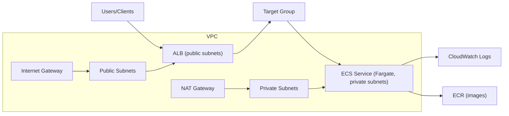
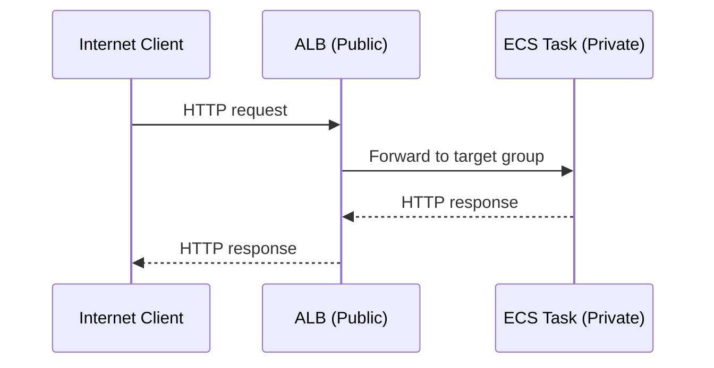
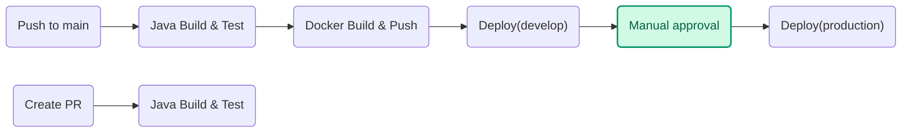

# Patterns Lab

## Table of Contents

- [Infrastructure overview](#infrastructure-overview)
- [Required AWS credentials and permissions](#required-aws-credentials-and-permissions)
- [Prerequisites & setup instructions](#prerequisites--setup-instructions)
- [Terraform run commands](#terraform-run-commands)
- [Build application](#build-application)
- [Required GitHub secrets](#required-github-secrets)

## Architecture diagram

### Architecture overview

High-level view of the infrastructure components and their relationships.



### Networking flow

Client requests flow through the public ALB to ECS tasks in private subnets, and responses return the same path. NAT is used only for outbound traffic (e.g., pulling images or calling external APIs).



### CI/CD flow

On push to `main`, the pipeline builds and tests the app, builds and pushes the Docker image to ECR, then deploys to ECS (dev → prod with approval).



## Infrastructure overview

AWS setup managed by Terraform:

- VPC with public/private subnets across 2 AZs
- Application Load Balancer (public) with health checks
- ECS Fargate cluster + service (autoscaling enabled)
- ECR repository for Docker images
- CloudWatch Log Group for application logs
- IAM roles for ECS task execution and app runtime

---

## Prerequisites & setup instructions

**Pre-commit set up**: to keep a consistent style, use the Makefile (via your IDE or CLI) when setting up or working
with the repository.

Install the hooks (including commit-msg):

```bash
pre-commit install
pre-commit install --hook-type commit-msg
```

**Before run Terraform**: for convenient and quick access to AWS CLI, as well as to make it easier to work with
Terraform, you need to execute these commands

```bash
aws sts get-caller-identity # check identity configureation 
aws configure # if you are not authorized in AWS
```
---

## Required AWS credentials and permissions

Terraform and CI/CD use an IAM user or role with programmatic access:

- Credentials: `AWS_ACCESS_KEY_ID` + `AWS_SECRET_ACCESS_KEY` (and `AWS_REGION`)
- Used by: Terraform CLI locally and GitHub Actions workflow

Required permissions should cover:

- VPC, subnets, route tables, NAT/IGW
- ECS (cluster, service, task definitions, autoscaling)
- ECR (repositories, image push/pull)
- ALB (load balancer, listeners, target groups, security groups)
- IAM (create roles and attach policies for ECS tasks)
- CloudWatch Logs (log groups and streams)

Recommended approach:

- Create a dedicated IAM role/user for Terraform (e.g., `terraform-deployer`).
- Attach a scoped policy that allows managing: VPC, ECS, ECR, ALB, IAM roles for ECS tasks, and CloudWatch Logs.

For this assignment, broad permissions (e.g., `AdministratorAccess`) are acceptable, but a scoped least‑privilege policy is recommended in real environments.

---

## Terraform run commands

Since there is no separate CI/CD for Terraform in this example, the commands for running via terminal are provided
below.

Also, to switch between different environments, you need to add the `-reconfigure` flag to the `init` command.

**Develop**

- `terraform init -backend-config=environments/develop.backend.hcl`
- `export AWS_ACCESS_KEY_ID, AWS_SECRET_ACCESS_KEY, etc.`
- `terraform plan  -var-file=environments/develop.tfvars`
- `terraform apply -var-file=environments/develop.tfvars -auto-approve && terraform output -json > develop-outputs.json`
- `terraform destroy -var-file=environments/develop.tfvars`

**Production**

- `terraform init -backend-config=environments/production.backend.hcl -reconfigure`
- `export AWS_ACCESS_KEY_ID, AWS_SECRET_ACCESS_KEY, etc.`
- `terraform plan  -var-file=environments/production.tfvars`
- `terraform apply -var-file=environments/production.tfvars -auto-approve && terraform output -json > production-outputs.json`
- `terraform destroy -var-file=environments/production.tfvars`

---

## Build application
To manually launch and debug the application, you can use the following commands. They are basic, but generally allow you to launch the application.

```bash
docker build -f docker/Dockerfile -t demo:local .

docker run -d --name demo --restart unless-stopped -p 8080:8080 \
  -e JAVA_OPTS="-Xms128m -Xmx256m" demo:local
```
---

### Required GitHub secrets

For the main branch uses `develop` environments secrets:

### Develop:

| KEY                   | TYPE     |
|-----------------------|----------|
| AWS_SECRET_ACCESS_KEY | secret   |
| AWS_ACCESS_KEY_ID     | secret   |
| AWS_ACCOUNT_ID        | variable |
| AWS_REGION            | variable |
| ECR_REPOSITORY_URL    | variable |
| ECS_CLUSTER_NAME      | variable |
| ECS_SERVICE_NAME      | variable |
| ECS_CONTAINER_NAME    | variable |
| NEW_RELIC_APP_NAME    | variable |
| NEW_RELIC_LICENSE_KEY | secret   |

Production deployments require a GitHub Actions environment named `production`
with the same variables/secrets and manual approval enabled (Environment protection rules).

### Production:

**ECR_REPOSITORY_URL** - here you need to add values from develop, because develop image promote to production

| KEY                   | TYPE     |
|-----------------------|----------|
| AWS_SECRET_ACCESS_KEY | secret   |
| AWS_ACCESS_KEY_ID     | secret   |
| AWS_ACCOUNT_ID        | variable |
| AWS_REGION            | variable |
| ECR_REPOSITORY_URL    | variable | 
| ECS_CLUSTER_NAME      | variable |
| ECS_SERVICE_NAME      | variable |
| ECS_CONTAINER_NAME    | variable |
| NEW_RELIC_APP_NAME    | variable |
| NEW_RELIC_LICENSE_KEY | secret   |
